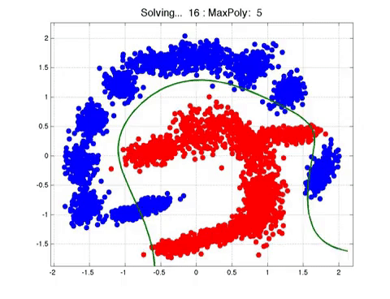

This project uses several important Machine Learning classification algorithms on a data set of 346 indidividuals who have graduated from university. At the end of this workflow, our algorithms should be able to predict whether or not an individual will be able to pay off their student loan. This is achieved by looking at some key features of the data.

All code can be found in ``loans.py``

## Pre-processing
We  will deploy feature selection (after converting categorical features into numerical values) and one hot key encoding (for converting categorical to binary).
We shall normalise the data to have a 0 mean with variance of 1.

## Algorithms used:
* K Nearest Neighbours
* Decision Tree
* SUpport Vector Machine
* Logistic Regression

## K Nearest Neighbours

For this, we first need to find the best number of nearest neighbours to look at (best k-value). In my code, we try k = 1 to k = 14, and chose the best one to our training data.

## Decision Tree Classification

## Support Vector Machine

## Logistic Regression

